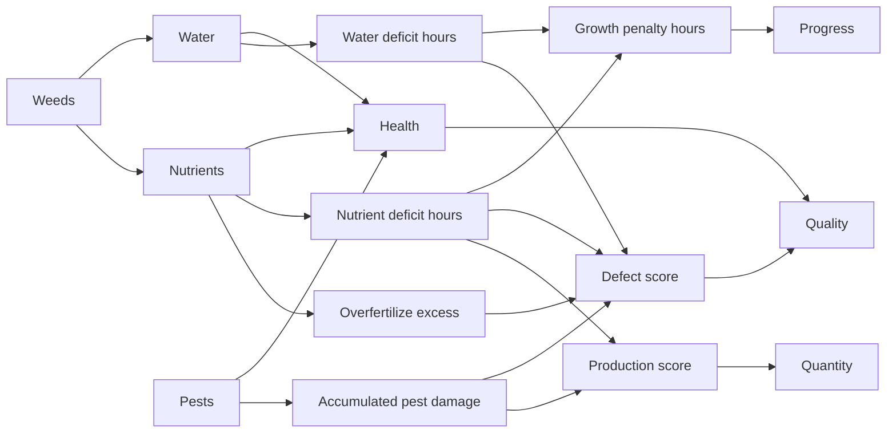

# Plan — Advanced Vegetable Care (Causal Condition Model)

> Status: implemented for resource version 0.2.0; disabled by default pending
> opt-in server rollout.
> Scope: server-authoritative Lua farming engine only (no web hub, no new NUI/minigame).
> Ships behind `Config.Features.AdvancedCare = false` by default.

## Overview

Replace the current single-scalar, care-independent-growth model with a causal
simulation where water, nutrients, weeds, and pests each drive distinct, named
outcomes — health, growth speed, harvest quantity, and harvest quality with a
visible dominant defect — while staying lazy-evaluated, server-authoritative,
and backward-compatible.

## Confirmed design decisions

1. **Growth speed is coupled to water/nutrient sufficiency.** This
   intentionally reverses the current documented rule in
   [`shared/physiology.lua`](../shared/physiology.lua) ("a neglected crop
   still ripens, it just ripens badly"). A sustained deficit now slows
   maturation, not just final quality.
2. **Harvest quantity and quality become two independent scores** instead of
   quantity being interpolated directly from the same number as quality, as it
   is today in `Quality.Yield`
   ([`server/modules/farming/quality.lua`](../server/modules/farming/quality.lua)).
3. **Harvested produce carries a visible dominant defect tag** (e.g.
   water-cracked, nutrient-burned, pest-scarred) in its `ox_inventory`
   metadata, not just a numeric tier.
4. **Stress events are weighted more heavily inside a per-crop critical growth
   window** (flowering/fruit-set), defined as a progress range on top of the
   existing `stages[].ratio` schema in [`config/crops.lua`](../config/crops.lua).
5. **Nutrients, weeds, and pests are each independently toggleable on/off, at
   two levels; water is never toggleable.** A global master switch can disable
   a condition for the whole server, and no per-crop setting can re-enable
   what the global switch disabled. A crop can additionally disable a
   condition for itself even when the global switch allows it (e.g. tomato
   ignores weeds and pests while other crops still have them).
   Intensity/severity is not a separate percentage dial — it is already
   expressed through each crop's own condition parameters from §3 below, the
   same way `water.decayPerHour` already differs per crop today.

## Rollout flag and non-goals

- Ship behind `Config.Features.AdvancedCare = false` by default in
  `config/config.lua`, mirroring the existing `Config.Features.Minigames`
  pattern. Every new callback, target option, and sync field checks this flag
  before doing anything, so the feature can merge disabled and be turned on
  per-server without a second deploy.
- No new NUI or minigame ships in this slice (fertilize/weed/treat use the
  same placeholder-progress pattern as today's water/harvest actions).
- No SQL migration is required: every new field lives inside the existing JSON
  `data` column.
- Multi-harvest, machinery, progression/XP, and economy stay out of scope,
  unchanged from today.

## Two-level enable gating

```lua
Config.Farming.ConditionEffects = {
    Nutrients = true,
    Weeds = true,
    Pests = true,
}
```

Per crop, in `config/crops.lua`:

```lua
tomato = {
    ...
    conditionEffects = { weeds = false, pests = false }, -- nutrients omitted -> inherits global
}
```

Resolution: `effectiveEnabled(condition, crop) = globalEnabled[condition] AND
(cropOverride[condition] ?? true)`. The global flag is a hard ceiling — a crop
table can only narrow it further, never widen it. Water has no entry in this
table and is always active.

When `effectiveEnabled` is false for a condition on a given crop, that
condition is fully inert for that crop: [`shared/conditions.lua`](../shared/conditions.lua)
skips computing it (no decay, no accumulation, zero added cost), it is
omitted from the sync payload, and no matching `ox_target` option
(fertilize/weed/treat) is ever offered for that crop's slots. This keeps the
per-condition parameters in §3 meaningful only when the condition is actually
switched on for that crop.

## Causal model



Water/health stays as-is (already real). Everything downstream of "deficit
hours" / "pest damage" / "overfertilize excess" is new: these are
**persisted, bounded accumulators**, not instantaneous levels, because
quality/quantity/growth depend on *history*, not a single snapshot — the same
reason `health` already persists instead of being recomputed from scratch
each time.

## Persisted data schema (`record.data`)

All new fields are optional and additive inside the existing JSON `data`
column — old records without them must default sanely (treated as if the
feature had just been enabled: full nutrients, zero weeds/pests/penalties).

- `nutrients` (0..100, default 100) — current level, same shape as existing
  `water`.
- `weedCover` (0..100, default 0).
- `pestPressure` (0..100, default 0).
- `growthPenaltyHours` (>= 0, default 0) — persisted accumulator consumed by
  `Growth.Evaluate`.
- `waterStressAccumulated`, `nutrientStressAccumulated` (0..100 bounded,
  default 0) — feed the defect score.
- `pestDamageAccumulated` (0..100 bounded, default 0) — feeds both the defect
  score and the production score.
- `lastCare` — reused as the single decay anchor for water, nutrients, weeds,
  and pests (no separate timestamp per condition), consistent with how it
  already anchors water/health today.

None of these fields are added to a crop's data when its condition is gated
off (see two-level gating above); they simply never appear for that crop,
keeping old-record backward compatibility trivial (`tonumber(data.field) or
default` everywhere, exactly like `shared/physiology.lua` already does for
`water`/`health`).

## 1. Shared raw-trajectory layer (new)

Add [`shared/conditions.lua`](../shared/conditions.lua): pure functions
computing, from `(record, now)`, the decayed levels of `nutrients`,
`weedCover`, `pestPressure`, and the *deficit-hour deltas* since `lastCare`
for water and nutrients, and the *pest-damage delta* from sustained high pest
pressure — using the same "hours since anchor, clamp, dampen by tolerance"
math family already proven in `shared/physiology.lua`'s `dryHours`
calculation. Weeds accelerate water/nutrient decay via a multiplier; pest
onset is delayed and accelerated by weed neglect. Every function first
resolves `effectiveEnabled` for its condition (global × per-crop gate, see
above) and short-circuits to a neutral no-op result when disabled, so a crop
with pests turned off never allocates or decays that state.

This module exists so that `shared/growth.lua` (needs deficit hours for the
growth penalty) and `shared/physiology.lua` (needs the same raw levels for
health/defect/production) can both consume one pure source without a
file-load cycle — both call into `Sonar.Conditions.*` through the global
table at runtime, so load order does not matter.

## 2. Growth penalty (couples growth to care)

Extend [`shared/growth.lua`](../shared/growth.lua):

- `Growth.Evaluate` computes `effectiveElapsed = elapsed -
  persistedGrowthPenaltyHours - pendingPenaltyThisWindow`, then `progress =
  effectiveElapsed / growthTime`, clamped at 0.
- `pendingPenaltyThisWindow` is derived live (not yet committed) from
  `Sonar.Conditions` the same way `health`'s pending loss is computed live
  before a settle — this keeps `Growth.Evaluate` pure and lets the client
  predict identically without extra network chatter.
- The persisted `data.growthPenaltyHours` accumulator is committed at every
  settle point (see §4), exactly like `health` already accumulates permanent
  damage from `dryHours` today.

## 3. Per-crop configuration

Extend [`config/crops.lua`](../config/crops.lua) per crop with:

- `nutrients = { decayPerHour, optimalMin, optimalMax, overfertilizeCeiling }`
- `weeds = { growthPerHour, resistance }`
- `pests = { onsetHours, susceptibility }`
- `criticalWindow = { from, to }` (progress 0..1, validated `from < to`, both
  within `[0,1]`)

Differentiate the four MVP crops the same way `water` already differs
(tomato: narrow/sensitive critical window and high pest susceptibility;
potato: wide/tolerant window and strong pest resistance; lettuce: fast onset,
high nutrient demand; carrot: forgiving across the board) so each crop keeps
exercising distinct code paths. Severity is entirely expressed through these
per-crop numeric parameters — there is no separate global "percentage of
effect" dial; only the on/off gate from the section above is global.

Add the optional per-crop `conditionEffects = { nutrients, weeds, pests }`
override table and `Config.Farming.ConditionEffects` global defaults, plus
matching bounds/invariant checks in
[`shared/config_validation.lua`](../shared/config_validation.lua) (numeric
ranges, `criticalWindow.from < to`, and that `conditionEffects` keys are
booleans), new tool/cooldown/threshold entries in
[`config/config.lua`](../config/config.lua), and new items
(`fertilizer_organic`, `fertilizer_chemical`, `hand_hoe`,
`pest_spray_organic`, `pest_spray_chemical`) in
[`data/ox_inventory_items.lua`](../data/ox_inventory_items.lua).

Register the new files in [`fxmanifest.lua`](../fxmanifest.lua):
`shared/conditions.lua` must load in `shared_scripts` before
`shared/growth.lua` and `shared/physiology.lua` (both call into it);
`server/modules/farming/cultivation.lua` loads in `server_scripts` alongside
the existing `care.lua`/`harvest.lua`/`plant.lua` entries.

## 4. Server-authoritative actions

Extend [`shared/constants.lua`](../shared/constants.lua):
`ACTIONS.FERTILIZE/WEED/TREAT_PEST`, matching `CALLBACKS`, new `REJECT`
reasons (`NUTRIENTS_SATURATED`, `NO_WEEDS_DETECTED`, `NO_PEST_DETECTED`,
`CONDITION_DISABLED` for a crop/server where the targeted condition is gated
off), and `PUBLIC_EVENTS.CROP_FERTILIZED/WEEDED/TREATED`.

Generalize `Physiology.Apply` in
[`server/modules/farming/physiology.lua`](../server/modules/farming/physiology.lua)
into a settle routine that commits water, nutrients, weeds, pests, health,
spoilage, `growthPenaltyHours`, and the defect/production accumulators
together from one `Sonar.Conditions` pass. Add `Physiology.Fertilize`,
`Physiology.Weed`, `Physiology.TreatPests` mutators alongside the existing
`Physiology.Water`.

Add new file
[`server/modules/farming/cultivation.lua`](../server/modules/farming/cultivation.lua)
mirroring the exact pipeline already in
[`server/modules/farming/care.lua`](../server/modules/farming/care.lua)
(`Runtime.GuardPlayer` → `Security.Consume` → `Validation.Cooldown` →
`Validation.AntiTeleport` → `Validation.Crop` → `Lock.With` →
`Validation.Distance` → `Validation.CanCare` → tool/item check → settle →
mutate → `Sync.OnCropChanged` → public event):

- **Fertilize**: rejects only when nutrients are at the saturation ceiling;
  pushing nutrients past `optimalMax` (but below the ceiling) is allowed but
  adds to the defect accumulator instead of being blocked — the
  "overfertilize burns" consequence, without a hard spam block.
- **Weed**: rejects below a minimum `weedCover` threshold
  (`NO_WEEDS_DETECTED`).
- **Treat pests**: rejects when `pestPressure` is below a minimum threshold
  (`NO_PEST_DETECTED`).

## 5. Production vs. quality split at harvest

In [`server/modules/farming/quality.lua`](../server/modules/farming/quality.lua):

- Add `Quality.ResolveProduction(record, condition)` → 0..100, driven by
  accumulated pest damage and critical-window nutrient deficiency.
  `Quality.Yield` now interpolates units from **this** score instead of the
  blended quality score.
- Keep `Quality.Resolve` for the sale-tier quality score, now also blending
  in the defect accumulator (water/nutrient/pest-caused), in addition to the
  existing skill/care/spoilage/theft/mechanized terms.
- Add `Quality.DominantDefect(record)` selecting whichever contributor
  (water, nutrients, pests) contributed most to the defect accumulator,
  returning a stable key (`water_stress`, `nutrient_burn`, `pest_damage`, or
  `none`).
- Extend `Quality.Metadata` to attach `{ defect, productionScore }` alongside
  the existing `{ quality, tier, label }`.

Update [`server/modules/farming/harvest.lua`](../server/modules/farming/harvest.lua)
to compute and pass both scores through this pipeline. Normalize the existing
`plantScore`/`plantingQuality` mismatch (direct plant vs. tomato minigame) so
both feed the same harvest contract, since they now both interact with the
defect/production split.

## 6. Client exposure

- [`server/modules/sync/subscriptions.lua`](../server/modules/sync/subscriptions.lua):
  extend the sync payload with `nutrients`, `weedCover`, `pestPressure`, and
  `growthPenaltyHours` so the client's shared evaluators predict identically
  (same principle already used for `water`/`health`/`lastCare`).
- [`client/modules/interaction/actions.lua`](../client/modules/interaction/actions.lua):
  add `Actions.Fertilize`, `Actions.Weed`, `Actions.TreatPests` — placeholder
  progress bars, no new minigame in this slice (logic first).
- [`client/modules/zones/slots.lua`](../client/modules/zones/slots.lua): new
  target options gated both by the same condition thresholds the server
  enforces and by `effectiveEnabled` for that crop — a crop with pests turned
  off never shows a "Treat pests" option at all, not just a disabled one.
- [`client/modules/render/target.lua`](../client/modules/render/target.lua):
  inspect text summarizes nutrients/weeds/pests and, once mature, the
  dominant defect risk.
- Planting states and dead crops remain fully excluded from every new action,
  preserving existing guards.

## 7. Tests and documentation

Add to [`tests/run.lua`](../tests/run.lua): the gating resolution matrix
(global on/crop on, global on/crop off, global off/crop on stays off, global
off/crop unset stays off), nutrient decay/fertilize/overfertilize
consequence, weed growth/removal and its acceleration of water/nutrient
decay, pest onset/acceleration-by-weeds/treatment, growth penalty stretching
maturation under sustained deficit, critical-window weighting (same deficit
inside vs. outside the window produces different defect impact),
production/quality independence (a pest-heavy-but-well-watered crop vs. an
erratically-watered-but-pest-free crop produce different score
combinations), backward compatibility for records predating these fields,
and dominant-defect selection.

Update [`docs/API.md`](API.md) (new callbacks/rejects),
[`docs/DECISIONES.md`](DECISIONES.md) (record the five confirmed decisions,
including the reversal of the "growth is care-independent" rule and the
two-level gating model), [`README.md`](../README.md), and
[`CHANGELOG.md`](../CHANGELOG.md). Run the Lua test suite and config
validation.

## Definition of done

- `lua tests/run.lua` passes, including every new case listed above.
- Config validation rejects malformed
  `nutrients`/`weeds`/`pests`/`criticalWindow`/`conditionEffects` blocks with
  clear errors, and accepts crops that omit them entirely (falling back to
  defaults with every new condition effectively off until explicitly
  configured on).
- With `Config.Features.AdvancedCare = false`, behavior is byte-for-byte
  identical to today: no new fields written, no new target options, no new
  callbacks reachable.
- With the flag on and a crop's `conditionEffects` fully enabled, neglecting
  a slot demonstrably slows its maturation, degrades its eventual quality
  with a specific dominant defect tag, and reduces harvested unit count —
  each independently attributable to the condition that caused it.
- With a crop's `conditionEffects` set to disable weeds/pests (tomato example
  from this discussion), no weed/pest state, sync fields, or target options
  ever appear for that crop, while other crops keep them.
- Existing DB records created before this change load and evaluate without
  errors (no SQL migration performed).

Implementation evidence: the dependency-free Lua suite covers configuration,
gating, backward compatibility, causal trajectories, critical-window weighting,
growth penalty, mutations, production/quality independence and dominant defect
selection. Release CI parses all Lua and repeats these regressions before a tag
can publish a package.

## Task checklist

- [x] Add two-level (global master switch + per-crop override) enable gating
      for nutrients, weeds, and pests; water always mandatory.
- [x] Introduce shared raw-trajectory math and persisted accumulators for
      nutrients, weeds, pests, growth penalty, and stress/damage.
- [x] Couple growth speed to sustained water/nutrient deficit via a
      persisted growth-penalty accumulator.
- [x] Define per-crop nutrient/weed/pest parameters, critical growth window,
      tools, and validation.
- [x] Implement authoritative fertilize, weed, and pest-treatment actions
      with anti-spam and overfertilize consequences.
- [x] Split harvest outcome into an independent production score and a
      defect-tagged quality score.
- [x] Expose condition-driven targets, progress actions, sync, and
      inspection text.
- [x] Add regression coverage for every causal path and update
      documentation.
